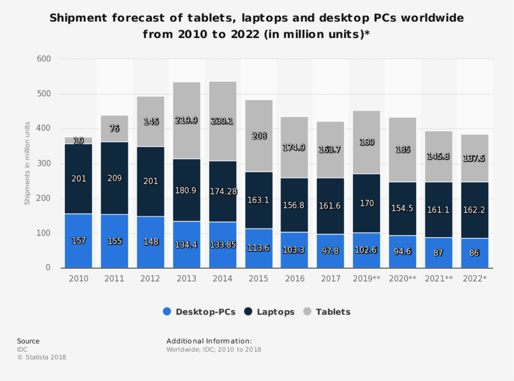
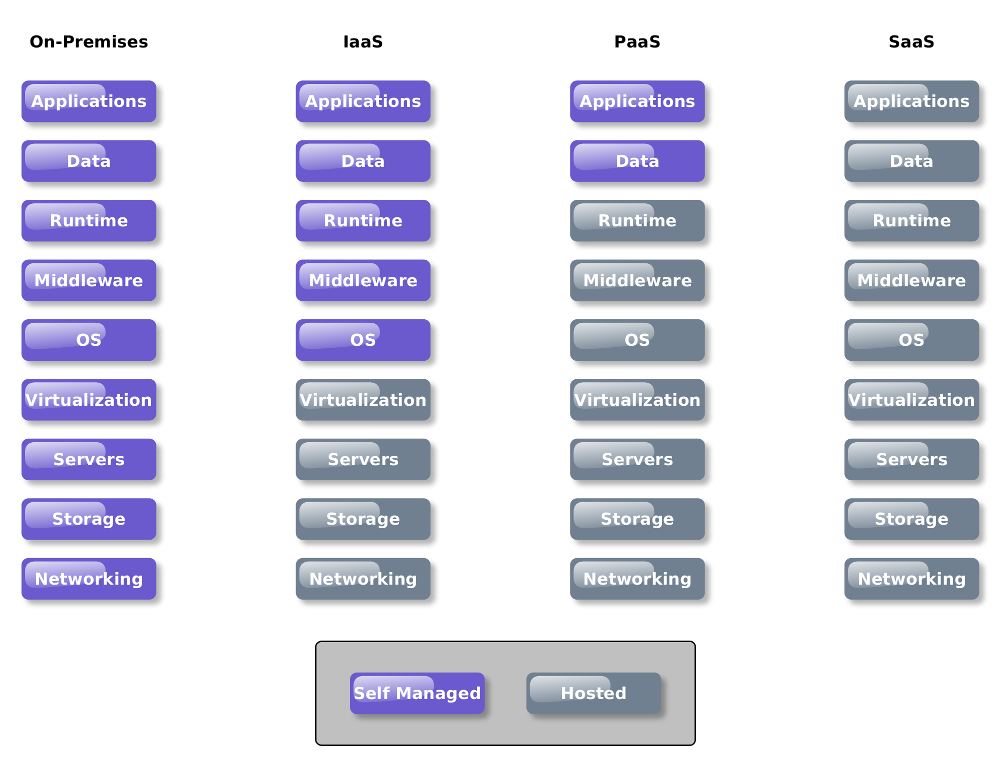

# The Future of Computer Systems

## Trends

### End-user

- Desktop -> Laptop -> Tablet
- Commoditised hardware
- Online services
- Desktop as a Service (DaaS)

### Impact on Development

- Web first approach
- Collaborative tools
- Multiple platforms

## Service Model

## Software as a Service (SaaS)

- **Service**: Enterprise applications delivered through the browser
  - Everything from Email, Customer Relationship Management, Collaboration
- Streamlines enterprise IT management
  - Vendor is responsible for maintaining the OS, runtimes, patches, backup, hardware

- **Examples** include: Google Apps, Salesforce, Citrix GoToMeeting, Office 365, GitHub, GitLab

## Infrastructure as a Service (IaaS)

- **Service**:  virtualized access to hardware instances
- **Example**: Microsoft Azure/AWS EC2/Google cloud is one of the biggest examples
  - Various hardware specifications available
  - Both shared and dedicated instances
    - Dedicated instances provide a greater degree of security and predictability of performance

- **Advantage**
  - Reduce hardware purchase and support costs
  - Allows rapid rescaling of resources
    - scale up efficiently on peak demand at a low cost

- **Responsibility**
  - Have to install patches
  - keep OS to date
  - manage software and applications

- **Security Issues**
  - Replication makes scaling easy but also can lead to replication of vulnerabilities
    - Old images not being updated
    - Poorly configured server instance replicated 100’s of times
    - Incorrect security settings leading to massive data loss
  - **Misconfiguration**
    - Amazon Simple Cloud Storage Service (S3)
      - Nothing inherently insecure about it, just far too easy to setup incorrectly
      - In 2013 Rapid7 survey 12,000 S3 buckets and found that 1 in 6 where left open to the public
    - AWS EC2
      - By default AWS instances will have some degree of insecurity
        - Globally accessible
        - Password based access
        - Publicly accessible metadata available at /latest/meta-data/
  - **Compromised Credential** 
    - AWS Credential compromise is a growing problem
    - Never hard code your AWS credentials or store them in a git repository
    - Incurs financial cost

## Platform as a Service (PaaS)

- Provides a framework for rapid development and deployment of applications
  - Potentially across multiple platforms
- Select frameworks to add to application, then develop the application
  - No managing the installation or updating of the underlying frameworks
  - Generally provides **auto-scaling**
  - Often uses Git or Kubernetes to deploy applications
- **Example**
  - Salesforce Heroku
  - AWS Elastic Beanstalk
  - Microsoft Azure,
  - RedHat OpenShift
  - Google App Engine

## Serverless - Function as a Service

- Developer takes no interest in infrastructure or software stack, just the **functionality of the application**
- Development is simplified, no low level handling of requests, functions are small pieces of code expected to run in milliseconds
- **Content delivery**: Static content served via Content Delivery Network
- **Example**: Alexa
  - Allows easy access to advanced APIs and functionality
  - Including Amazon Alexa
  - Using some configuration and single JavaScript function it is possible to implement an Alexa Skill which users can then interact with
  - All delivered without configuring a server or installing a software library

- **Advantage**
  - Allows companies to focus on what differentiates them, which is their product/application, and not on infrastructure, which is largely commoditised anyway

## What does this mean for a System Administrator?

- The role isn’t going to disappear anytime soon
- But the skillset is changing
  - Configuration vs. Installation
- Serverless may well dominate in the application development space, but it is not suited to long running or high performance tasks
- Could see a shift away from PaaS to Serverless, but IaaS will always be around
- Awareness of best practice, network configuration, security, and privacy will be paramount

