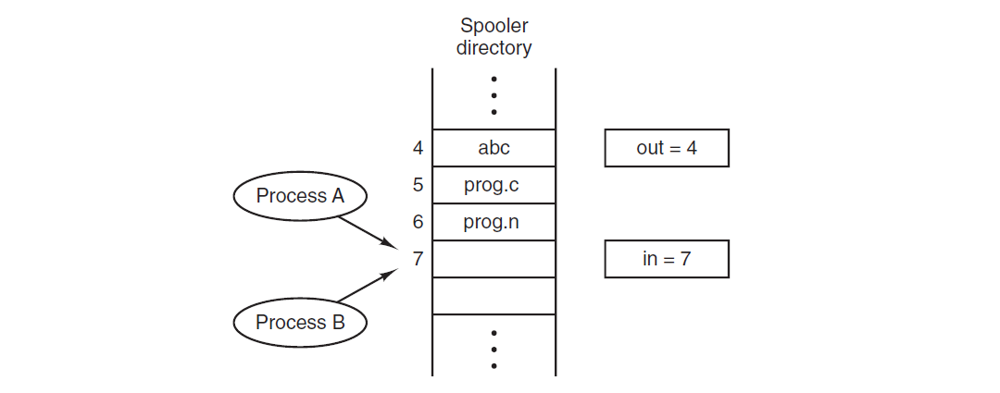
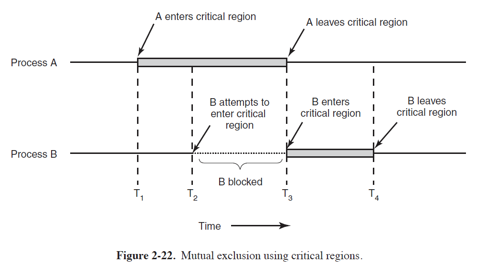
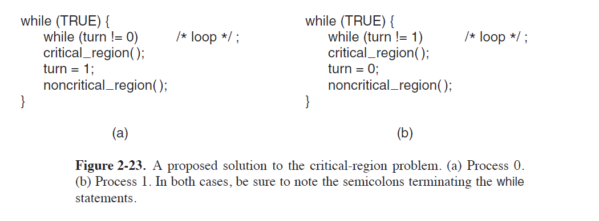
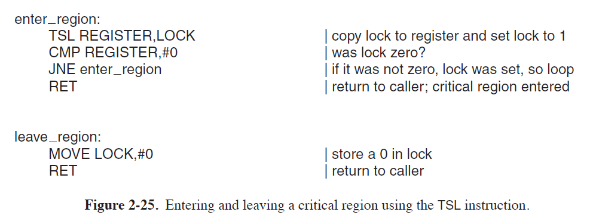
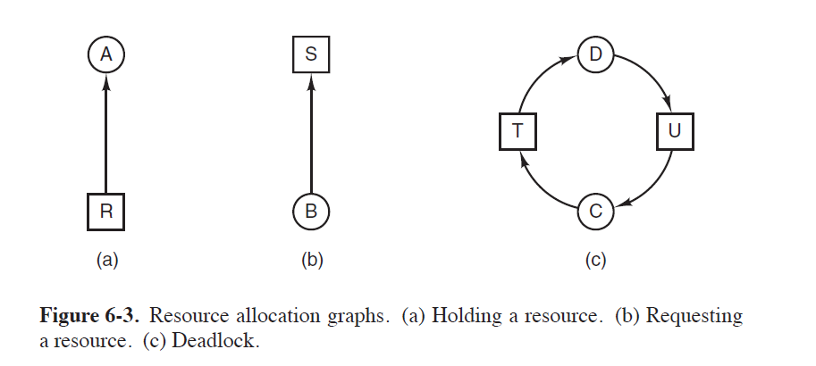

[TOC]

## Race condition

- Situations like this, where two or more processes are reading or writing some **shared data** and **the final result depends** on who runs precisely when, are called **race conditions**.
  - Debugging programs containing race conditions is no fun at all.

- Example
  - 
  - **Setting**: 
    - When a process wants to print a file, it enters the file name in a special spooler directory. Another process
    - the printer daemon, periodically checks to see if there are any files to be printed, and if there are, it prints them and then removes their names from the directory.
  - Process A reads in and stores the value, 7, in a local variable called next free slot.
  - Just then a clock interrupt occurs and the CPU decides that process A has run long enough, so it switches to process B.
    - Process B also reads in and also gets a 7. 
    - It, too, stores it in its local variable next free slot. At this instant both processes think that the next available slot is 7.
    - Process B now continues to run. It stores the name of its file in slot 7 and updates in to be an 8.
  - Eventually, process A runs again, starting from the place it left off. It looks at next free slot, finds a 7 there, and writes its file name in slot 7, erasing the name that process B just put there.
  - Process B will never receive any output.

### Critical Regions

- **Mutual exclusion**: if one process is using a shared variable or file, the other processes will be excluded from doing the same thing.
- **Critical region**: 
  - The part of the program where the shared memory is accessed is called the **critical region** or **critical section**. 
  - If we could arrange matters such that no two processes were ever in their critical regions at the same time, we could avoid races.
- **Assumptions**
  - No two processes may be simultaneously inside their critical regions.
  - No assumptions may be made about speeds or the number of CPUs.
  - No process running outside its critical region may block any process.
  - No process should have to wait forever to enter its critical region.

### Disabling Interrupts

- On a single-processor system, the simplest solution is to have each process **disable**
  **all interrupts** just after entering its critical region and re-enable them just before
  leaving it.
  - Once a process has disabled interrupts, it can examine and update the shared
    memory without fear that any other process will intervene.

- **Problem**
  - Unwise to give user processes the power to turn off interrupts.
    - What if one of processes turn off interrupts, and never turned them on again?
  - If the system is a multiprocessor (with two or more CPUs) disabling interrupts affects only the CPU that executed the disable instruction. 
    - The other ones will continue running and can access the shared memory.
- **Conclusion**
  - Disabling interrupts often a useful technique within the operating system itself but is not appropriate as a general mutual exclusion mechanism for user processes.
  - In a multicore system disabling the interrupts of one CPU does not prevent other CPUs from interfering with operations the first CPU is performing.

### Lock Variables

- When a process wants to enter its critical region, it first tests the lock. 

  - If the lock is 0, the process sets it to 1 and enters the critical region. 
  - If the lock is already 1, the process just waits until it becomes 0.
- Thus, a 0 means that no process is in its critical region, and a 1 means that some
  process is in its critical region.
- When a process wants to enter its critical region,
  it first tests the lock. If the lock is 0, the process sets it to 1 and enters the
  critical region. If the lock is already 1, the process just waits until it becomes 0.
  Thus, a 0 means that no process is in its critical region, and a 1 means that some
  process is in its critical region.
- **Problem**
  - Suppose that one process reads the lock and sees that it is 0. 
    - Before it can set the lock to 1, another process is scheduled, runs, and sets the lock to 1
    - When the first process runs again, it will also set the lock to 1, and two processes will be in their critical regions at the same time.
  - The race now occurs **if the second process modifies the lock just after the first process has finished its second check.**

### Strict Alternation

- In Fig. 2-23, the integer variable `turn`, initially 0, keeps track of whose turn it is to enter the critical region and examine or update the shared memory.

- **Problem**

  - The faster process will loop until the slower process sets turn to 0. 
    - taking turns is not a good idea when one of the processes is much slower than the other
  - This situation violates condition 3 set out above: 
    - process 0 is being blocked by a process not in its critical region.
    - requires that the two processes strictly alternate in entering their critical regions

  

### Test and Set Lock (TSL)

- It reads the contents of the memory word lock into register RX and then stores a nonzero value at the memory address lock. 
  - The operations of reading the word and storing into it are guaranteed to be indivisible
  - The CPU executing the TSL instruction locks the memory bus to prohibit other CPUs from accessing memory until it is done.
- We use a shared variable, `lock`, to coordinate access to shared memory. 
  - When lock is 0, any process may set it to 1 using the TSL instruction and then read or write the shared memory. 
  - When it is done, the process sets lock back to 0 using an ordinary move instruction.

- Before entering its critical region,  a process calls enter region, which does busy waiting until the lock is free; 
  - then it acquires the lock and returns. 
  - After leaving the critical region the process calls leave region, which stores a 0 in lock.

### Busy Waiting

- When a process wants to enter a critical section
  - it checks if the entry is allowed
  - If not, the process executes a loop, checking if it is allowed to enter a critical section

- Continuously testing a variable until some value appears is called **busy waiting**. 

- It should usually be avoided, since it wastes CPU time.
-  A lock that uses busy waiting is called a **spin lock**.

#### Priority Inversion Problem

- Consider a computer with two processes, 
  - H, with high priority, and 
  - L, with low priority. 
- The scheduling rules are such that H is run whenever it is in ready state.
- At a certain moment, 
  - with L in its critical region, H becomes ready to run, H now begins busy waiting, 
  - but since L is never scheduled while H is running,  L never gets the chance to leave its critical region, so H loops forever.
- This situation is sometimes referred to as the **priority inversion problem**.

### Blocking

- `Sleep` is a system call that causes the caller to block
  - that is, be suspended until another process wakes it up.
- The `wakeu`p call has one parameter, the process to be awakened.

- Approach
  - Attempt to enter a critical section
  - If critical section available, enter it
  - If not, register interest in the critical section and block
- When the critical section becomes available, the OS will unblock a process waiting for the critical section, if one exists

- Using blocking constructs improves the CPU utilization

## Deadlock

**Resources**

- A major class of deadlocks involves resources to which some process has been granted exclusive access. 
- These resources include devices, data records, files, and so forth. 
- To make the discussion of deadlocks as general as possible, we will refer
  to the objects granted as **resources.**

- **Deadlock**
  - A set of processes is deadlocked if each process in the set is waiting for an event that only another process in the set can cause
  - In other words, each member of the set of deadlocked processes is waiting for a resource that is owned by a deadlocked process.
    - This kind of deadlock is called a resource deadlock.
- 
- **Deadlock Modelling**
  - A directed arc from a process to a resource means that the process is currently
    blocked waiting for that resource.
  - A directed arc from a resource node (square) to a process node (circle) means that the resource has previously been requested by, granted to, and is currently held by that process.
  - A cycle in the graph means that there is a deadlock involving the processes and resources in
    the cycle (assuming that there is one resource of each kind).
  - **resource graphs** are a tool that lets us see if a given request/release sequence leads to deadlock.

- **Strategies**
  - Just ignore the problem. Maybe if you ignore it, it will ignore you.
  2. Detection and recovery. Let them occur, detect them, and take action.
  3. Dynamic avoidance by careful resource allocation.
  4. Prevention, by structurally negating one of the four conditions.