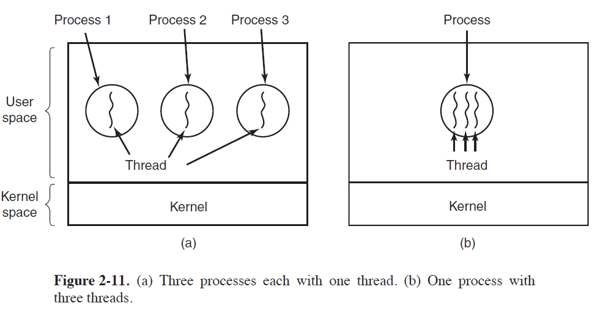
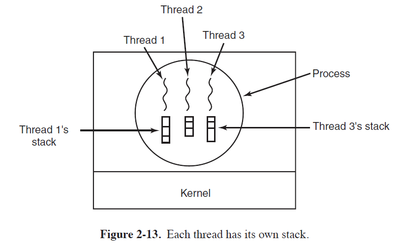
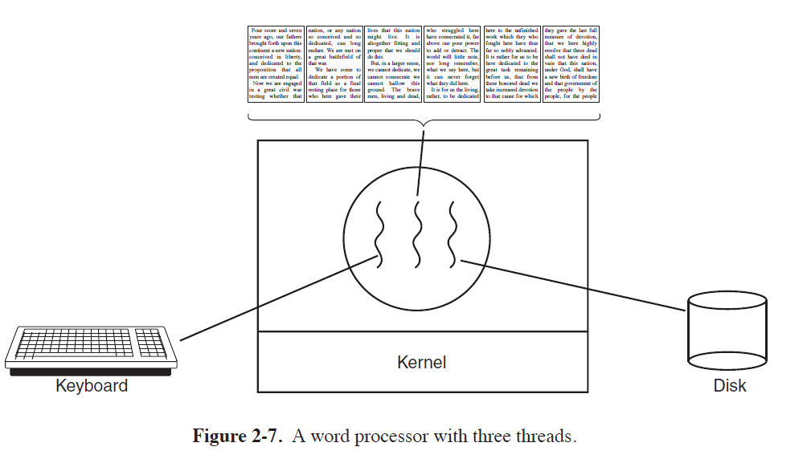
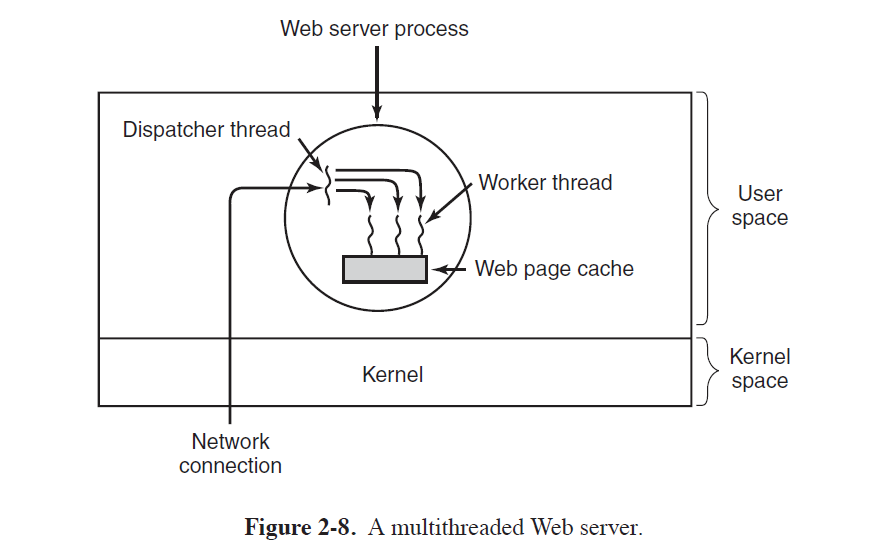
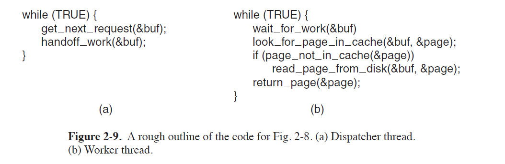
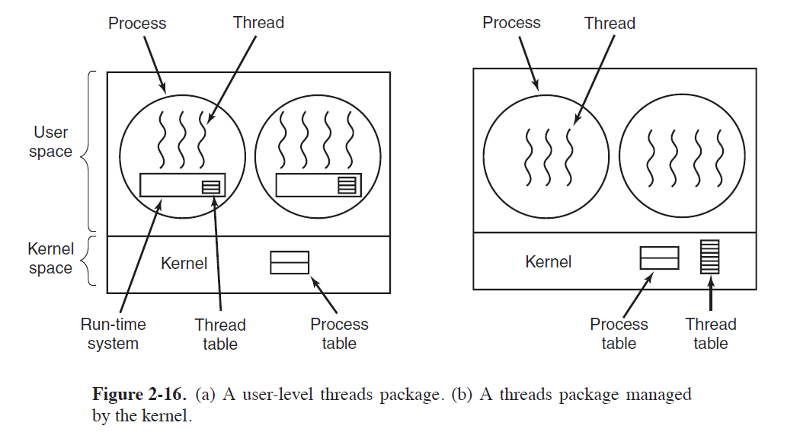

[TOC]

# Thread

## What is a thread?

- **Process**
  - it is a way to group related resource together
    - address space containing program text and data
    - other resources(open files, child processes, pending alarms, signal handlers)
- **Thread**

  - **Definition**: a sequential execution stream within the process.

  - **Threads** are the entities scheduled for execution on the CPU.
    - The CPU switches rapidly back and forth among the threads, providing the
      illusion that the threads are running in parallel, albeit on a slower CPU than the
      real one.
  - **Threads** are sometimes called lightweight processes.
    - Because threads have some of the properties of processes, 
- **Multithreading** 
- describe the situation of allowing multiple threads in the same process.

## What's shared between threads?



- All threads have exactly the same **address space**, which means that they also share the same **global** **variables**.
  - In addition to sharing an address space, all the threads can share the same **set of open files**, **child processes**, **alarms**, and **signals**, an so on, as shown in Fig. 2-12
  - The ability for multiple threads of execution to share a set of resources so that they can work **together** closely to perform some task.

- Each thread has its own **state**
  - `running`: A running thread currently has the CPU and is active.
  - `blocked`: a blocked thread is waiting for some event to unblock it. 
  - `ready`: a ready thread is scheduled to run and will as soon as its turn comes up. 
  - `terminated`
- Each thread has its own **stack**
  - Each thread will generally call different procedures and thus have a different execution history. This is why each thread needs its own stack.
  - 

| Per-process Items          | Per-thread items                            |
| -------------------------- | ------------------------------------------- |
| Address space              | Program counter                             |
| Global variables           | Registers                                   |
| Open files                 | Stack(local variables, function call stack) |
| Child processes            | State                                       |
| Pending alarms             |                                             |
| Signal and signal handlers |                                             |
| Accounting information     |                                             |

- **Problem**
  - What happens if one thread closes a file while another one is still reading from it?

## Why do we need thread?


- **Address Space sharing**  
  - the ability for the parallel entities to share an address space and all of its data among themselves.
- **Easy to create and destroy**
  - Threads are easier (i.e., faster) to create and destroy than processes.
    - because they are lighter weight than processes, 
- **Performance gain on I/O bound application**
  - Threads yield no performance gain when all of them are CPU bound, 
  - but when there is substantial computing and also substantial I/O, having threads allows these activities to overlap, thus speeding up the application.
- **Real parallelism** 
  - Useful on systems with multiple CPUs, where real parallelism is possible.



## Word Processor Example

- **Scenario**: word processor automatically saving the entire file to disk**
- **Problem**
  - if the program were single-threaded, then whenever a disk backup started,
    commands from the keyboard and mouse would be ignored until the backup was
    finished.
- **Solution**
  - The first thread just interacts with the user. 
  - The second thread writes the contents of RAM to disk periodically.
- **Having multiple process would not work**
  - because all three threads need to operate on the document.

## Web Server Example

### Multi-threaded

	

- **Assumption**: a system call blocks only the calling thread, not the entire process.
- Web servers use `cache` to improve performance by maintaining a collection of heavily used pages
  in main memory.
- the **dispatcher**
  - reads incoming requests for work from the network
  - After examining the request, it chooses an idle (i.e., blocked) worker thread and hands it the request
- the **worker**
  - wakes up
  - checks to see if the request can be satisfied from the Web page cache
    - If not, it starts a read operation to get the page from the disk and blocks until the disk operation completes.
    - When the thread blocks on the disk operation, another thread is chosen to run, possibly
      the dispatcher
- This model allows the server to be written as a collection of sequential threads.
  - 
  - The dispatcher’s program consists of an infinite loop for getting a work request and
    handing it off to a worker. 
  - Each worker’s code consists of an infinite loop consisting of accepting a request from the dispatcher and checking the Web cache to see if the page is present.

### **Single threaded web server**

- The main loop of the Web server gets a request, examines it, and carries it out to completion before getting the next one.

- the CPU is simply idle while the Web server is waiting for the disk.
- result is many fewer requests/sec can be processed.

## POSIX Threads

- To make it possible to write portable threaded programs, IEEE has defined a standard for threads in IEEE standard 1003.1c. The threads package it defines is called `Pthreads`.

- **Attribute Structure**:  All pthreads threads have certain properties. Each one has an identifier, a set of
  registers (including the program counter), and a set of attributes, which are stored
  in a structure.

### TL;DR

| Thread call            | Description                                          |
| ---------------------- | ---------------------------------------------------- |
| `pthread create`       | Create a new thread                                  |
| `pthread_exit`         | Terminate the calling thread                         |
| `pthread_join`         | Wait for a specific thread to exit                   |
| `pthread_yield`        | Release the CPU to let another thread run            |
| `pthread_attr_init`    | Create and initialize a thread’s attribute structure |
| `pthread_attr_destroy` | Remove a thread’s attribute structure                |

### `pthread create`  

- A new thread is created using the` pthread_create` call. 
- The thread identifier of the newly created thread is returned as the function value. 

### `pthread_exit`  

- When a thread has finished the work it has been assigned, it can terminate by
  calling `pthread_exit`. 
- This call stops the thread and releases its stack.

### `pthread_join`  

- The thread that is waiting calls `pthread_join` to wait for a specific other thread to terminate. 
- The thread identifier of the thread to wait for is given as a parameter.

## `pthread_yield`  

- Sometimes it happens that a thread is not logically blocked, but feels that it has
  run long enough and wants to give another thread a chance to run. 
- It can accomplish this goal by calling `pthread_yield`.

### `pthread_attr_init`  

- `pthread_attr_init`  creates the attribute structure associated with a thread and initializes it to the default values.
- These values (such as the priority) can be changed by manipulating fields in the attribute structure.

### `pthread_attr_destroy`  

- `pthread_attr_destroy` removes a thread’s attribute structure, freeing up its memory. 
- It does not affect threads using it; they continue to exist.

### Example

- When a thread is created, it prints a one-line message announcing itself, then it
  exits. 
- The order in which the various messages are interleaved is nondeterminate and may vary on consecutive runs of the program.

```c
#include <stdio.h>
#include <pthread.h>
#include <unistd.h>

void* print_hello(void* _) {
    printf("Hello\n");
}

void* spawn(void* _) {
    pthread_t tid1, tid2, tid3;
    pthread_create(&tid1, NULL, print_hello, NULL);
    pthread_create(&tid2, NULL, print_hello, NULL);
    pthread_create(&tid3, NULL, print_hello, NULL);

    // comment/uncomment
    pthread_join(tid1, NULL);
    pthread_join(tid2, NULL);
    pthread_join(tid3, NULL);
}

int main() {
    pthread_t tid1, tid2;
    pthread_create(&tid1, NULL, spawn, NULL);
    pthread_create(&tid2, NULL, spawn, NULL);

    // comment/uncomment
    pthread_join(tid1, NULL);
    pthread_join(tid2, NULL);
    // usleep(700);
    return 0;
}
```

## Implementing Threads in User Space



- The first method is to put the threads package entirely in user space. 
- The kernel knows nothing about them. 
  - As far as the kernel is concerned, it is managing ordinary, single-threaded processes.

- **OS-independent**
  - A user-level threads package can be implemented on an operating system that does not support threads.
  - With this approach, threads are implemented by a library
- **Thread table**:  
  - When threads are managed in user space, each process needs its **own** private thread table to keep track of the threads in that process.
  - keeps track only of the per-thread properties, such as each thread’s program counter, stack pointer, registers, state, and so forth.
  - managed by the runtime system
    - When a thread is moved to ready state or blocked state, the information needed to restart it is stored in the thread table

- **Advantage**

  - **Thread switching** : Doing thread switching is at least an order of magnitude faster than trapping to the kernel
    - If the machine happens to have an instruction to store all the registers and another
      one to load them all, the entire thread switch can be done in just a handful of instructions.

  - **Thread scheduling**
    - The procedure that saves the thread’s state and the scheduler are just local procedures,
      so invoking them is much more efficient than making a kernel call. 
    - Among other issues, no trap is needed, no context switch is needed, the memory cache need not be flushed, and so on. 

  - **Customized scheduling Algorithm**
    - User space threads allow each process to have its own customized scheduling algorithm.
  - **Scalability**: User space threads also scale better
    - since kernel threads invariably require some table space and stack space in the kernel, which
      can be a problem if there are a very large number of threads.

- **Disadvantage**
  - **Blocking system call stop all threads**
    - If one thread makes a system call, all the threads/the entire process will be stopped.
    - Changing to non-blocking system call?
      - Requiring changes to the operating system
        - require changes to many user proglem
      - User-level threads could run with existing operating systems.
    - When this call is present, the library procedure read can be replaced with a new one that first does a select call and then does the read call only if it is safe (i.e., will not block).
      - If the read call will block, the call is not made **Instead, another thread is run**
      - This approach requires rewriting parts of the system call library, and is inefficient
        and inelegant, but there is little choice. 
  - **Page fault stop all threads**
    - If a thread causes a page fault, the kernel blocks the entire process until the disk I/O is complete 
      - even though other threads might be runnable
  - **If a thread starts running, no other thread in that process will ever run unless the first thread voluntarily gives up the CPU.**
    - Unless a thread enters the run-time system of its own free will, the scheduler will never get a
      chance.
    - **Possible solution**
      - have the run-time system request a clock signal (interrupt) once a second to give it control,
        but this, too, is crude and messy to program.

## Implementing Threads in the Kernel

- No run-time system is needed in each process

- No thread table in each process
- the kernel has a **thread table** that keeps track of all the threads in the system.
  - The kernel’s thread table holds each thread’s registers, state, and other information.
- All calls that might block a thread are implemented as system calls
  - at considerably greater cost than a call to a run-time system procedure.
- **Thread recycling**
  - When a thread is destroyed, it is marked as not runnable, but its kernel data structures are not otherwise affected. 
  - When a new thread must be created, an old thread is reactivated, saving some overhead.
  - Also possible for user-level threads, but since the thread-management overhead is much
    smaller, there is less incentive to do this.
- **Advantage**
  - Kernel threads do not require any new, nonblocking system calls.
  - If one thread in a process causes a page fault, the kernel can easily check to see if
    the process has any other runnable threads
    - if so, run one of them while waiting for the required page to be brought in from the disk
- **Disadvantage**
  - The cost of a system call is substantial
    - if thread operations (creation, termination, etc.) a common, much more overhead will be incurred.

- **Problem**
  - What happens when a multithreaded process forks? 
    - Does the new process have as many threads as the old one did, or does it have just one?
  - When a signal comes in, which thread should handle it?
    - What happens if two or more threads register for the same signal?

